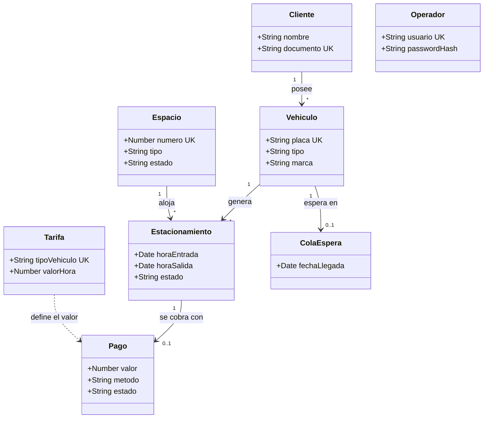
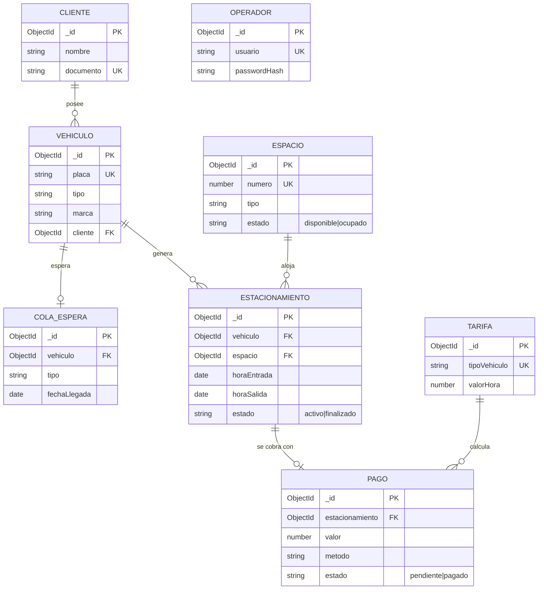

# Diagramas del sistema

## Diagrama de clases

```mermaid
classDiagram
  class Cliente {
    +String nombre
    +String documento UK
  }
  class Vehiculo {
    +String placa UK
    +String tipo
    +String marca
  }
  class Espacio {
    +Number numero UK
    +String tipo
    +String estado
  }
  class Estacionamiento {
    +Date horaEntrada
    +Date horaSalida
    +String estado
  }
  class Pago {
    +Number valor
    +String metodo
    +String estado
  }
  class Tarifa {
    +String tipoVehiculo UK
    +Number valorHora
  }
  class ColaEspera {
    +Date fechaLlegada
  }
  class Operador {
    +String usuario UK
    +String passwordHash
  }

  Cliente "1" --> "*" Vehiculo : posee
  Vehiculo "1" --> "*" Estacionamiento : genera
  Espacio "1" --> "*" Estacionamiento : aloja
  Estacionamiento "1" --> "0..1" Pago : se cobra con
  Vehiculo "1" --> "0..1" ColaEspera : espera en
  Tarifa ..> Pago : define el valor
```

## Diagrama de base de datos (colecciones MongoDB)

```mermaid
erDiagram
  CLIENTE ||--o{ VEHICULO : posee
  VEHICULO ||--o{ ESTACIONAMIENTO : genera
  ESPACIO ||--o{ ESTACIONAMIENTO : aloja
  ESTACIONAMIENTO ||--o| PAGO : "se cobra con"
  VEHICULO ||--o| COLA_ESPERA : espera
  TARIFA ||--o{ PAGO : calcula

  CLIENTE {
    ObjectId _id PK
    string nombre
    string documento UK
  }
  VEHICULO {
    ObjectId _id PK
    string placa UK
    string tipo
    string marca
    ObjectId cliente FK
  }
  ESPACIO {
    ObjectId _id PK
    number numero UK
    string tipo
    string estado "disponible|ocupado"
  }
  ESTACIONAMIENTO {
    ObjectId _id PK
    ObjectId vehiculo FK
    ObjectId espacio FK
    date horaEntrada
    date horaSalida
    string estado "activo|finalizado"
  }
  PAGO {
    ObjectId _id PK
    ObjectId estacionamiento FK
    number valor
    string metodo
    string estado "pendiente|pagado"
  }
  TARIFA {
    ObjectId _id PK
    string tipoVehiculo UK
    number valorHora
  }
  COLA_ESPERA {
    ObjectId _id PK
    ObjectId vehiculo FK
    string tipo
    date fechaLlegada
  }
  OPERADOR {
    ObjectId _id PK
    string usuario UK
    string passwordHash
  }
```
